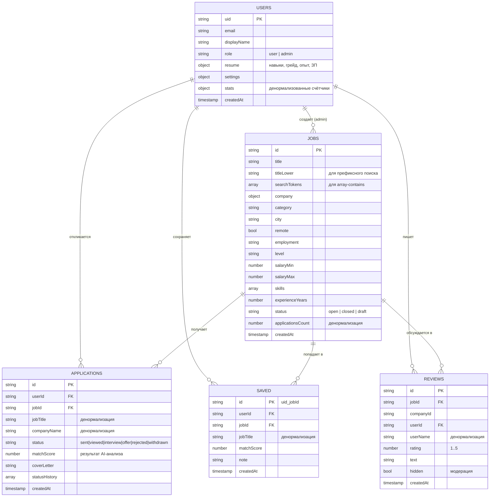

# Схема базы данных — AI JobHub (Cloud Firestore)

Документная БД, 5 рабочих коллекций верхнего уровня плюс служебная `meta`.
Вложенных подколлекций нет намеренно: плоская структура позволяет делать запросы
«все отклики пользователя» и «все отклики по вакансии» одним индексом, без
collection group queries.

Проект: `ai-jobhub`, регион базы — `eur3` (Европа).

## ER-диаграмма

## 1. `users/{uid}` — пользователи

Требование ТЗ 4.1.1: профили, роли и настройки. ID документа = Firebase Auth UID,
поэтому профиль читается за одно чтение по `doc(db,'users',uid)` без запроса.

| Поле | Тип | Описание |
|---|---|---|
| `uid` | string | дубль ID документа, удобно при выборках |
| `email` | string | из Firebase Auth |
| `displayName` | string | имя, ≤ 80 символов (проверяется правилами) |
| `photoURL` | string \| null | ссылка на аватар в Firebase Storage (`avatars/{uid}/avatar.jpg`) или `null` |
| `role` | string | `user` (по умолчанию) или `admin` |
| `phone`, `city`, `about` | string | контакты и краткое описание |
| `resume` | map | резюме для AI-анализа: `title`, `level`, `yearsExperience`, `skills[]`, `desiredSalary`, `employment[]`, `remoteOnly`, `education`, `links{}` |
| `settings` | map | `theme` (`dark`/`light`, применяется при входе), `emailNotifications` |
| `stats` | map | `applicationsCount`, `savedCount`, `reviewsCount` — денормализованные счётчики, обновляются через `increment()` в тех же пачках (`writeBatch`), что и сами действия |
| `disabled` | bool | блокировка админом |
| `createdAt`, `updatedAt`, `lastLoginAt` | timestamp | |

Роль лежит **только** в этом документе и меняется только админом — правила безопасности
запрещают клиенту трогать поле `role` при обновлении своего профиля.

## 2. `jobs/{jobId}` — вакансии (основная сущность)

| Поле | Тип | Описание |
|---|---|---|
| `title` | string | название |
| `titleLower` | string | название в нижнем регистре; заготовка под префиксный поиск, сейчас поиск идёт через `searchTokens` |
| `searchTokens` | array\<string\> | токены названия + компании + навыков, ≤ 40 шт. — для `array-contains` |
| `description` | string | полное описание |
| `responsibilities`, `requirements`, `niceToHave`, `benefits` | array\<string\> | списки |
| `company` | map | `{ id, name, logo, logoUrl, industry, size }`: `logo` — эмодзи-заглушка, `logoUrl` — картинка из Storage (`logos/{jobId}/logo.jpg`) или `null` |
| `companyName` | string | дубль `company.name` — чтобы фильтровать без вложенности |
| `category` | string | `frontend`, `backend`, `mobile`, `data`, `ai`, `devops`, `design`, `qa`, `pm`, `marketing` |
| `city` | string | Алматы / Астана / Шымкент / Караганда / Удалённо |
| `remote` | bool | удалёнка |
| `employment` | string | `full`, `part`, `project`, `internship` |
| `level` | string | `intern`, `junior`, `middle`, `senior`, `lead` |
| `salaryMin`, `salaryMax` | number | вилка в тенге |
| `currency` | string | `KZT` |
| `skills` | array\<string\> | требуемые навыки — вход для AI-мэтчинга |
| `experienceYears` | number | минимальный опыт |
| `status` | string | `open`, `closed`, `draft` |
| `applicationsCount`, `viewsCount`, `savesCount` | number | счётчики, обновляются через `increment()` |
| `createdAt`, `updatedAt`, `publishedAt` | timestamp | |
| `createdBy` | string | uid админа |

## 3. `applications/{appId}` — отклики (история действий)

Требование ТЗ 4.1.3. Денормализация `jobTitle` / `companyName` / вилки ЗП убирает
N дополнительных чтений при выводе истории откликов и админской таблицы.

| Поле | Тип | Описание |
|---|---|---|
| `userId`, `userName`, `userEmail` | string | кто откликнулся |
| `jobId`, `jobTitle`, `companyName`, `companyLogo`, `companyLogoUrl`, `city`, `salaryMin`, `salaryMax`, `level` | | денормализованный снимок вакансии на момент отклика |
| `status` | string | `sent` → `viewed` → `interview` → `offer` / `rejected`, либо `withdrawn` |
| `matchScore` | number | % соответствия, посчитанный AI-движком |
| `coverLetter` | string | сопроводительное, ≤ 2000 символов |
| `statusHistory` | array\<map\> | `{ status, at, by }` — журнал смен статуса |
| `createdAt`, `updatedAt` | timestamp | |

## 4. `saved/{uid}_{jobId}` — сохранённые вакансии (активные действия)

Требование ТЗ 4.1.4 — аналог корзины. **ID документа собран из uid и jobId**, поэтому
повторное сохранение перезаписывает документ, а не плодит дубли: не нужен запрос
«проверить, есть ли уже». Правила безопасности разбирают ID (`savedId.split('_')[0]`)
и запрещают писать в чужие документы.

| Поле | Тип | Описание |
|---|---|---|
| `userId`, `jobId` | string | связи |
| `jobTitle`, `companyName`, `companyLogo`, `companyLogoUrl`, `city`, `salaryMin`, `salaryMax`, `level`, `remote` | | снимок вакансии |
| `matchScore` | number | закэшированный % соответствия |
| `note` | string | личная заметка пользователя |
| `createdAt` | timestamp | |

## 5. `reviews/{reviewId}` — отзывы о работодателях

Интерактив на странице детального просмотра + объект модерации в админке.

| Поле | Тип | Описание |
|---|---|---|
| `jobId`, `companyId`, `companyName` | string | к чему относится |
| `userId`, `userName`, `userPhotoURL` | string \| null | автор и его аватар (денормализовано: список отзывов рисуется без чтения профилей) |
| `rating` | number | 1..5 |
| `text` | string | ≤ 1500 символов |
| `hidden` | bool | скрыт модератором |
| `moderatedBy` | string \| null | uid админа |
| `createdAt`, `updatedAt` | timestamp | |

## 6. `meta/stats` — готовые агрегаты (служебная)

Один документ со счётчиками для админ-панели: `jobs`, `openJobs`, `users`,
`applications`, `reviews`, `hiddenReviews`, `byStatus{}`, `updatedAt`.
Пишет его только Cloud Function `refreshStats` (Admin SDK правила не проверяет),
клиенту запись запрещена, чтение — только админу. Нужен, чтобы вкладка
статистики читала один документ вместо восьми агрегатных запросов.

Пока функции не развёрнуты, админка считает те же цифры через
`getCountFromServer()` — документ `meta/stats` при этом просто не используется.

---

## 7. Firebase Storage — файлы (аватары и логотипы)

Картинки в Firestore не хранятся: документ ограничен 1 МБ, а поле с картинкой
в base64 пришлось бы читать вместе с каждым документом выдачи. Поэтому файлы
лежат в Firebase Storage, а в Firestore попадает только ссылка.

| Путь в бакете | Что это | Кто пишет | Кто читает |
|---|---|---|---|
| `avatars/{uid}/avatar.jpg` | аватар пользователя, 256×256 JPEG | сам пользователь | все |
| `logos/{jobId}/logo.jpg` | логотип компании, 128×128 JPEG | админ (по custom claim) | все |

Решения по устройству:

* **Путь фиксированный, без случайного имени файла.** Повторная загрузка
  перезаписывает прежний объект, поэтому в бакете не копится мусор и не нужен
  отдельный список «какие файлы были у этого пользователя».
* **Уменьшение на клиенте.** `src/core/image.js` обрезает картинку по центру
  и сжимает через `<canvas>` до ~40 КБ ещё до загрузки: меньше трафика Storage
  и быстрее на мобильном интернете. Правила дополнительно ограничивают размер
  1 МБ и тип `image/*` — на случай загрузки в обход интерфейса.
* **Ссылка денормализована.** `users.photoURL`, `jobs.company.logoUrl`, а также
  копии `reviews.userPhotoURL` и `saved/applications.companyLogoUrl` — чтобы
  список отзывов или откликов рисовался одним запросом, без чтения профилей
  и вакансий по одной.
* **Если файла нет**, интерфейс показывает инициалы (аватар) или эмодзи
  `company.logo` (логотип). Битая ссылка тоже деградирует в инициалы —
  обработчик `error` на `` в `src/core/components.js`.

Правила доступа — [storage.rules](storage.rules); деплой вместе с остальными:
`npm run deploy:rules`. В демо-режиме Storage не используется: та же картинка
после уменьшения сохраняется в localStorage как data URL, контракт адаптеров
не меняется.

---

## Кто и что может делать (сводка правил)

| Коллекция | Чтение | Запись |
|---|---|---|
| `users` | свой профиль; админ — любой и список | свой профиль без полей `role` и `disabled`; роль меняет только админ |
| `jobs` | все, но запрос обязан содержать `status == 'open'`; черновики и закрытые — только админ | создание, правка и удаление — админ; авторизованный пользователь может менять только счётчики и только шагом ±1 |
| `applications` | свои (запрос сужен по `userId`); все — админ | создать свой со статусом `sent`; перевести в `withdrawn` с дописыванием ровно одной записи в журнал; прочие статусы — админ |
| `saved` | только свои | только свои; ID документа обязан быть `{uid}_{jobId}` |
| `reviews` | запрос обязан содержать `hidden == false`; скрытые — только админ | создать свой; править текст и оценку — автор; скрыть или удалить — админ |
| `meta` | админ | никто из клиентов (только Cloud Function) |
| Storage `avatars/{uid}/…` | все | только сам пользователь; удалить может он и админ |
| Storage `logos/{jobId}/…` | все | только админ (по custom claim `admin`) |

Эти сценарии закреплены тестами в `tests/rules.test.js` — запуск `npm run test:rules`.

---

## Индексы

Полный список — в `firestore.indexes.json` (45 составных индексов).

### Почему их именно столько

Составной индекс нужен на каждое сочетание «фильтры + сортировка». В каталоге
пять фильтров (направление, город, грейд, занятость, удалёнка) и четыре
сортировки, то есть 2⁵ × 4 = **128 сочетаний**, а с поиском — вдвое больше.
Лимит Firestore — 200 составных индексов на базу, и почти все они простаивали бы.

Поэтому запрос строится по правилу «статус + ОДИН самый избирательный фильтр +
сортировка», а остальные условия отсеиваются на клиенте (`planJobQuery` в
`src/data/firebase-backend.js`). Набор индексов становится обозримым:

| Группа | Сколько | Состав |
|---|---:|---|
| `jobs` без фильтров | 5 | `status` + каждая сортировка |
| `jobs` с одним фильтром | 25 | `status` + (`category`/`city`/`level`/`employment`/`remote`) + каждая сортировка |
| `jobs` с поиском | 5 | `status` + `searchTokens(array-contains)` + каждая сортировка |
| `applications` | 4 | `userId + createdAt`, `userId + status + createdAt`, `status + createdAt`, `jobId + createdAt` |
| `saved` | 1 | `userId + createdAt` |
| `reviews` | 4 | `jobId + hidden + createdAt`, `companyId + hidden + createdAt`, `userId + createdAt`, `hidden + createdAt` |
| `users` | 1 | `role + createdAt` |

Сортировок пять, а не четыре, потому что зарплата сортируется в обе стороны:
`createdAt DESC`, `applicationsCount DESC`, `salaryMax DESC`, `salaryMax ASC`,
`salaryMin ASC`. Направление `salaryMax ASC` объявлено явно — фильтр
«зарплата от» ставит диапазон на `salaryMax`, а Firestore требует, чтобы первая
сортировка шла по тому же полю.

Порядок полей внутри каждого индекса взят не «на глаз»: для каждого сочетания
запрос отправлялся в проект, и Firestore в ошибке `FAILED_PRECONDITION` сам
присылает ссылку с составом нужного индекса. В его порядке поля равенства идут
по алфавиту, а поле сортировки — последним; так и записано в файле. Для подбора
индекса порядок полей равенства не важен (важен состав префикса), но совпадение
с подсказкой исключает споры.

Покрытие проверяется тестом: `tests/query-plan.test.js` перебирает все
сочетания фильтров, сортировок, поиска и «зарплаты от», которые умеет построить
интерфейс, и требует, чтобы под каждое в `firestore.indexes.json` нашёлся
индекс. Без этого пропущенный индекс виден только в проде — запрос отвечает
`FAILED_PRECONDITION`, и каталог выглядит пустым.

`fieldOverrides` отключает автоиндексацию полей, по которым никогда не идут
запросы: `jobs.description`, `jobs.responsibilities`, `jobs.requirements`,
`jobs.benefits`, `jobs.niceToHave`, `applications.coverLetter`,
`applications.statusHistory`, `reviews.text`, `saved.note`. Firestore по
умолчанию индексирует каждое поле в обе стороны, а это оплаченные записи при
каждом сохранении документа.

## Оптимизация запросов

1. **Денормализация.** В `applications` и `saved` лежит снимок вакансии, поэтому список
   из 20 откликов — это 1 запрос, а не 1 + 20.
2. **Счётчики вместо `count()` на каждый рендер.** `applicationsCount`, `viewsCount`,
   `savesCount` обновляются атомарно через `increment()`.
3. **`getCountFromServer()`** в админской статистике: агрегат считается на сервере,
   документы не скачиваются (1 чтение вместо N).
4. **Курсорная пагинация** через `startAfter(lastDoc)` + `limit(12)` — без `offset`,
   который в Firestore всё равно тарифицируется как чтение пропущенных документов.
5. **Поиск без полнотекстового движка.** `array-contains` по `searchTokens`:
   в запрос уходит первый токен, остальные слова отсеиваются на клиенте.
6. **О `select()`.** В веб-SDK Firestore проекции полей нет (это возможность server-side
   SDK и Datastore-режима). Веб-эквивалент — та самая денормализация: списочные
   представления читают лёгкие документы `saved` / `applications`, а тяжёлый документ
   вакансии со всеми описаниями грузится только на странице детального просмотра.
